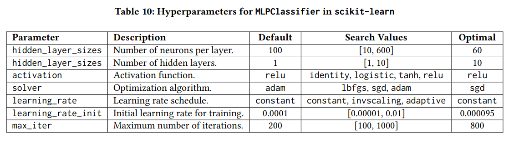
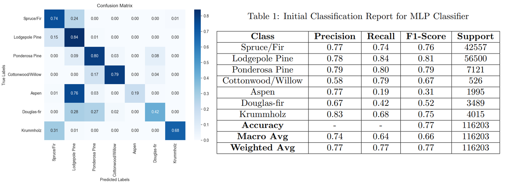
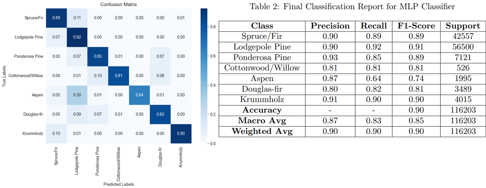

# MLP Classifier on CoverType Dataset

## Description
This project uses a Multi-Layer Perceptron and the CoverType Dataset to predict forest cover types using cartographic variables for 30x30 meter cells, with data derived from USFS and USGS sources. It analyzes four wilderness areas in the Roosevelt National Forest, which reflect ecological processes with minimal human disturbance.

## Table of Contents

- [Getting Started](#getting-started)
- [Running The Code](#running-the-code)
- [Hyperparameter Fine Tuning](#hyperparameter-fine-tuning)
- [Results](#results)
- [Conclusion](#conclusion)

## Getting Started
Clone the repository: 
`git clone https://github.com/tkjonesy/CoverType-MLP.git`

## Running the Code
1. Open `MLP.ipynb`.
2. Ensure all these packages are installed:  
    `pip install ucimlrepo sklearn matplotlib seaborn pandas numpy`
3. All training and experimenting took place with a `random_state=42`. Use this value to reproduce results.
4. Run all cells under the "Final Model" section. Be sure not to run the entire file, as the  "Hyper-Parameter Tuning" contains a lot of loops and will take a long time to run.

## Hyperparameter Fine Tuning

Table 10 shows the network architecture and hyperparameters tested to train the MLP on the Cover Type dataset, including their name, description, default value, search range, and optimal value after searching.

This fine-tuning was done one at a time, where all other parameters are held constant, the target parameter is varied, and the model is trained for each variation, and the results are plotted to find the optimal value. Looking back, this method got the job done, but I think that a grid search would have been more effective and efficient. 

## Results
### Initial Results Trained With Default Values:

### Final Results Trained With Optimal Values:

## Conclusion
Overall, The model performs well, but there is room for improvement. Looking at the final results, the model performs strongly on the first two classes, and slightly worse on the rest, which tells me the class imbalance of the dataset had an effect on the model's performance. Even with this imbalance, fine-tuning has yielded acceptable metrics which are a significant improvement over the preliminary results. Particularly for the Aspen tree, this class had a recall of 19% from the first model trained, which has been significantly boosted through experimenting with hyperparameters. Going forward, these results could potentially improve even further through the use of feature engineering and data preprocessing. Another potential improvement could be through further testing on the best number of hidden layers for the network. Due to the computational complexity, I was limited in testing up to 10 hidden layers. From the plots created, it seemed like a higher number of layers could still yield better results, but the model took too long to train, so I opted for a cutoff at 10 hidden layers. I am curious to see if additional hidden layers would yield better results while also not leading to overfitting.